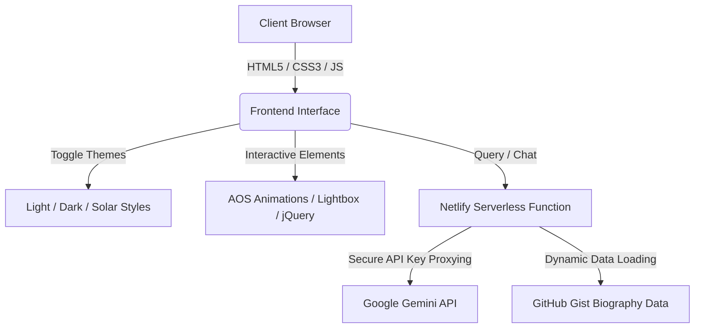

# Prianka Zaman Portfolio Website - Project Presentation Details

This document outlines the complete technical architecture, designs, page structures, deployment configuration, and AI model integration details of the **Prianka Zaman Portfolio Website**. It is structured to serve as a comprehensive reference for presentations or documentation.

---

## 📊 1. Overview & General Information

| Aspect | Details |
| :--- | :--- |
| **Project Type** | Professional Biography & Media Portfolio Website |
| **Target Audience** | Fans, casting directors, media producers, and general visitors |
| **Key Features** | Dynamic themes, video galleries, media press showcase, interactive social cards, and a Gemini-powered AI chatbot |
| **Code Repository** | [GitHub - JannatulBinteSneha/prianka-zaman](https://github.com/JannatulBinteSneha/prianka-zaman) |
| **Primary Languages** | HTML5, CSS3 (Vanilla), JavaScript (ES6+ client-side & Node.js serverless) |

---

## 🛠️ 2. Technology Stack

The project is built using a modern, lightweight, and highly optimized frontend stack combined with a serverless backend for secure API interactions.

### Frontend Technologies
*   **HTML5**: Semantic elements are utilized to establish clean page structures and improve SEO indexing.
*   **Vanilla CSS3**: Engineered with a robust custom properties (`:root` variables) design system enabling smooth, transition-based theme changes.
*   **JavaScript (ES6+)**: Handles theme management, back-to-top controls, lightbox logic, and asynchronous chatbot fetch requests.
*   **Bootstrap v3.3.7**: Provides the fundamental responsive grid layouts and basic navigation structures.
*   **jQuery v3.6.1**: Utilized as a dependency helper for Bootstrap's interactive features.
*   **AOS (Animate On Scroll v2.3.1)**: Powers premium entry animations on scroll events.
*   **FontAwesome Icons v6.2.0**: Used for vector icons (navigation labels, theme buttons, and social anchors).
*   **Google Fonts**: Embedded premium typefaces:
    *   *Poppins*: Clean, legible sans-serif for body copy and UI elements.
    *   *DM Serif Text / Playfair Display*: Elegant serif styles for headings.
    *   *Birthstone Bounce*: Artistic signature script font for logo/branding.

### Backend & AI Middleware
*   **Netlify Functions (Node.js)**: Serverless function located at [netlify/functions/gemini.js](file:///d:/My_Work/frontend/UI/prianka-zaman-main/netlify/functions/gemini.js). It acts as a secure middleware layer to hide API credentials and process model interactions.
*   **GitHub Gist**: Serves as a external content repository for the actress's bio dataset, ensuring information can be updated without redeploying code.

---

## 🤖 3. Artificial Intelligence (AI) Chatbot System

The portfolio features a smart virtual assistant that answers visitor questions about Prianka Zaman.

*   **AI Model**: **Gemini 3.5 Flash** (specifically `gemini-flash-latest` via Google Generative Language API).
*   **Integration Method**:
    1.  The client-side script ([chatbot.js](file:///d:/My_Work/frontend/UI/prianka-zaman-main/chatbot.js)) fetches the latest biography details directly from a GitHub Gist.
    2.  When a user submits a message, the chatbot script posts the message, the Gist biography dataset (`actressData`), and the rolling conversation history (limited to the last 10 messages to keep context lightweight) to the serverless function.
    3.  The serverless function compiles a detailed system prompt restricting the assistant's knowledge to the Gist dataset for actress-related queries while letting it answer general queries naturally.
    4.  It makes a secure POST call to Google's Gemini endpoint and returns a concise, emoji-friendly reply back to the browser.

---

## 🎨 4. Available Designs & Theme Customizations

The application implements a premium, interactive design language built on the **Glassmorphism** aesthetic (using `backdrop-filter: blur`).

### Tri-Theme Variable System
The website supports three distinct visual themes which toggle sequentially (Light ➔ Solar ➔ Dark ➔ Light) via the floating sun/moon/palette icon in the navigation bar.

1.  **Light Theme (Default)**
    *   *Colors*: Pristine white backgrounds (`#ffffff`), dark slate text (`#1e293b`), and vibrant tomato/coral accent gradients.
    *   *Aesthetics*: Clean, minimalist, and bright.
2.  **Dark Theme**
    *   *Colors*: Jet black/deep navy backgrounds (`#0b0b0e`), slate blue cards (`#13131a`), and gold accents (`#F7CE3E`).
    *   *Aesthetics*: Sleek, low-light optimized, and premium.
3.  **Solar Theme**
    *   *Colors*: Warm retro cream background (`#fdf6e3`), sand card elements (`#eee8d5`), and solar gold/orange highlights (`#b58900`).
    *   *Aesthetics*: High contrast, retro, and easy on the eyes.

### Premium Design Accents
*   **Glassmorphism**: The sticky navbar is styled with a translucent background, thin borders, and backdrop-blur styling.
*   **Cinematic Ken Burns Zoom**: The home page poster slowly zooms in and out over a 20-second cycle, adding a professional filmic atmosphere.
*   **Micro-Animations**: Custom hover states with scaling, gradients, and line-extensions that expand outwards from the center for active nav items.
*   **AOS Transitions**: Sections gently slide and fade into view as the user scrolls down.

---

## 📄 5. Pages Structure & Content

The website is divided into structured pages linked via the central glassmorphic navigation bar:

### 🏠 Home / Landing Page ([index.html](file:///d:/My_Work/frontend/UI/prianka-zaman-main/index.html))
*   **Hero Section**: High-resolution cinematic poster image of Prianka Zaman with overlay headlines.
*   **About Me Section**: Biography text paired with a portrait, highlighting her versatility.
*   **Achievements (Awards Showcase)**: Features four prestigious awards representing her work across different countries (Malaysia, Dubai, Australia, and Bangladesh). Includes a lightbox enlarger on image click.
*   **Chatbot Bubble & Popup**: Located at the bottom-right corner for interactive chat.
*   **Footer**: Social media links (Facebook, Instagram, YouTube, IMDb) and copyright details.

### 🖼️ Photo Gallery ([webpages/gallery.html](file:///d:/My_Work/frontend/UI/prianka-zaman-main/webpages/gallery.html))
*   A responsive masonry style gallery containing over 30 high-resolution photos loaded dynamically via a JavaScript loop.
*   Clicking any image launches a custom glassmorphic **Lightbox** overlay for close-up viewing.

### 📰 News ([webpages/news.html](file:///d:/My_Work/frontend/UI/prianka-zaman-main/webpages/news.html))
*   Presents 24 media clippings, newspaper headlines, and press coverage images in a grid card layout.
*   Equipped with a custom modal script for viewing newspaper clippings in full detail.

### 🎬 Dramas ([webpages/dramas.html](file:///d:/My_Work/frontend/UI/prianka-zaman-main/webpages/dramas.html))
*   A showcase of 14 curated television dramas.
*   Displays videos in a grid of responsive iframe containers embedded directly from YouTube.

### 🎵 Music Videos ([webpages/music-video.html](file:///d:/My_Work/frontend/UI/prianka-zaman-main/webpages/music-video.html))
*   Displays 12 music videos showcasing Prianka Zaman's acting roles in music projects since 2017.
*   Embeds YouTube video players cleanly into cards.

### 📺 Ads / Commercials ([webpages/billboard-ad.html](file:///d:/My_Work/frontend/UI/prianka-zaman-main/webpages/billboard-ad.html))
*   Focuses on her commercials and TVCs since 2013, highlighting collaborations with brands like *Maduli Jewelry, Famous TV, Pran RFL Glass, and Marquis Water Pump*.
*   Features a brand collage and a grid of embedded YouTube commercial advertisements.

### 🔗 Social Media Portal ([webpages/social-media.html](file:///d:/My_Work/frontend/UI/prianka-zaman-main/webpages/social-media.html))
*   A minimalist card layout linking directly to official social channels:
    *   **Facebook Page**: `https://www.facebook.com/zamanprianka`
    *   **Instagram Profile**: `https://www.instagram.com/prianka.zaman`
    *   **IMDb Profile**: `https://www.imdb.com/name/nm16434694/`
    *   **YouTube Channel**: `https://www.youtube.com/@priyankazaman1348`

---

## 🚀 6. Hosting, Version Control & Deployment

*   **Version Control & Repository Hosting**: Stored as a Git repository on **GitHub** (repository path: `JannatulBinteSneha/prianka-zaman`).
*   **Production Deployment Hosting**: Deployed on **Netlify**, a cloud hosting platform for modern web projects.
*   **Deployment Integration**:
    *   *Continuous Deployment (CD)*: Connected directly to the GitHub repository. Any pushes or merges into the main branch automatically trigger a new Netlify production build.
    *   *Serverless Routing*: Configured via [netlify.toml](file:///d:/My_Work/frontend/UI/prianka-zaman-main/netlify.toml) to map the functions directory to `netlify/functions`. This exposes the Gemini AI API proxy at the relative URI `/.netlify/functions/gemini` on the production domain.
    *   *Environment Variables*: The Gemini API key (`GEMINI_API_KEY`) is stored securely inside Netlify's backend environment settings, preventing exposure to client-side scripts.
